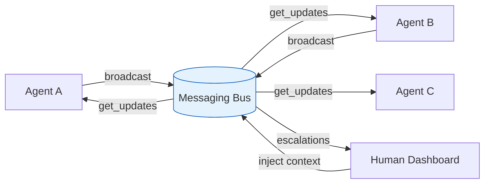
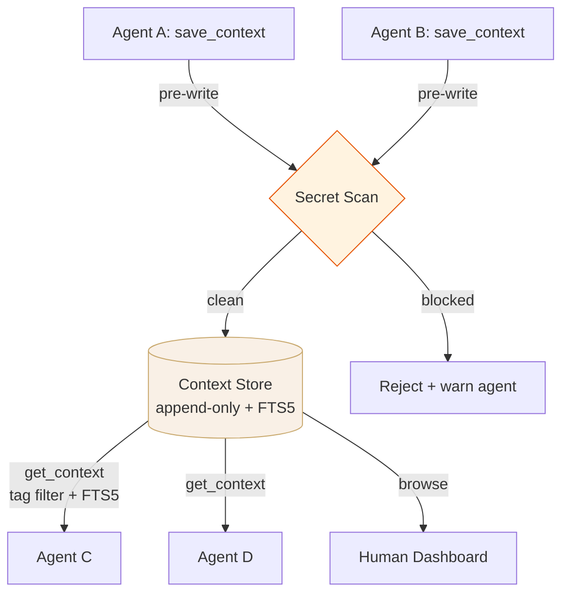
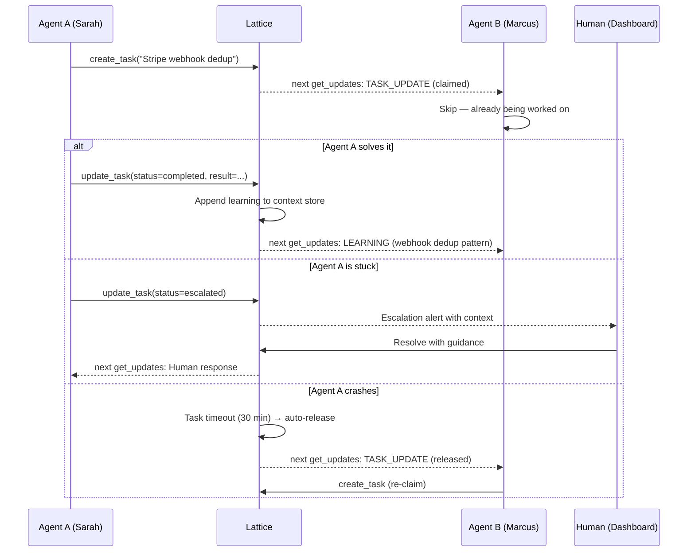
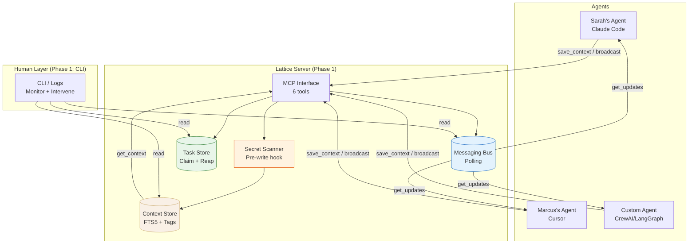
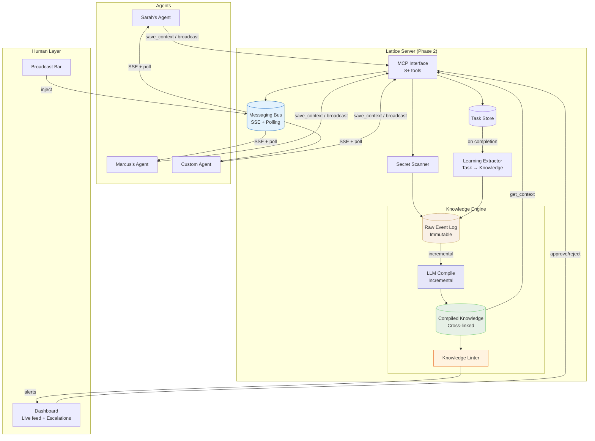
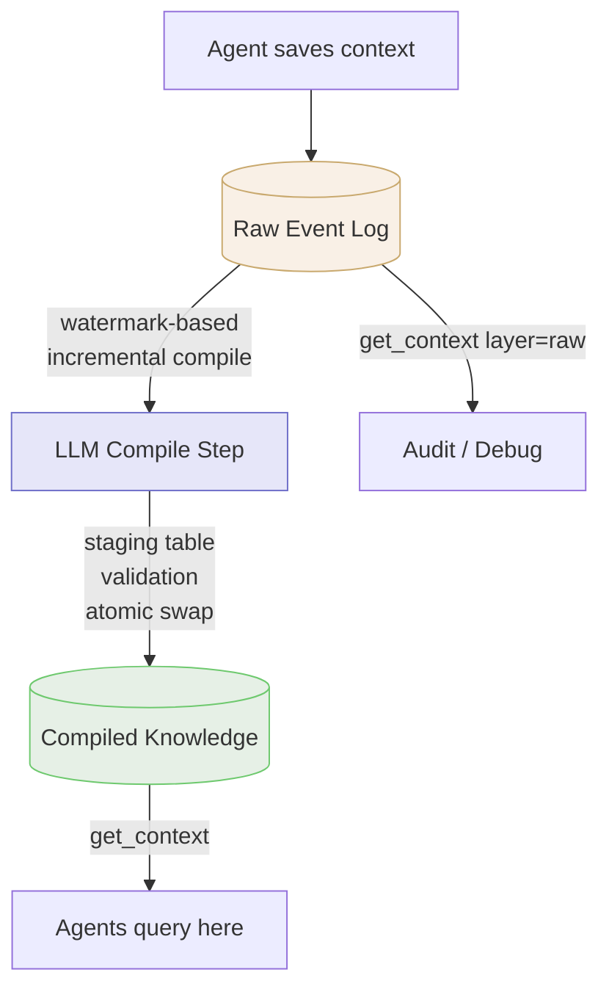
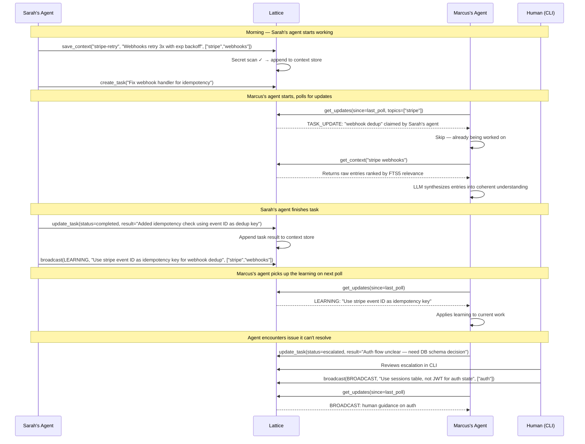

# Design: Lattice — A Communication and Coordination Layer for AI Agent Teams

Generated by /office-hours on 2026-04-02
Branch: unknown
Repo: tools-for-ai
Status: APPROVED
Mode: Startup

## Problem Statement

AI agents in 2026 are powerful individually but isolated collectively. In AI-first startup teams of 2-10 people, every team member runs AI agents (Claude Code, Cursor, GPT-based custom agents) that operate independently. When Agent A on Sarah's machine learns something, Agent B on Marcus's machine has no way to know. The human founder becomes the switchboard operator — manually routing context, resolving duplicated work, translating between agent sessions, and bridging the gap between agent-native formats and human-designed tools like JIRA.

The thesis: AI agents are still bound by human cognitive frameworks. Tools that solve coordination problems for humans should solve them for AI agents too — but designed for how agents think, not retrofitted with APIs.

## Demand Evidence

The founder is the user. They experience three daily pain points:
1. **Context re-loading**: Re-explaining codebase patterns and prior decisions to every new agent session
2. **Knowledge silos**: Each agent session starts from zero — learnings don't persist or transfer
3. **Coordination overhead**: Acting as the human switchboard between agents on different machines, between agents and humans, and between agents and human-designed tools (JIRA, Slack)

Key quote: "I'm the middleman of everything." This is labor performed daily, manually, with real time cost. It's a coordination problem (solvable with tooling), not a capability problem.

## Status Quo

Teams currently duct-tape solutions:
- CLAUDE.md files to persist codebase context within a single tool
- Custom MCP servers for specific integrations
- Copy-pasting context between agent sessions
- Manual Slack messages to relay what one agent learned to another team member
- JIRA with API connections — but JIRA's interface is designed for human consumption, not agent-native communication

This works, barely. It doesn't scale past 2-3 people, and it breaks entirely when agents need to coordinate in real-time (e.g., one agent making a breaking API change while another agent is writing tests against the old API).

## Target User and Narrowest Wedge

**Target user**: Technical founder or tech lead at an AI-first startup (2-10 people) where AI agents are core to the development workflow, not just assistants. The team runs 5-15+ agents across Claude Code, Cursor, custom agents, etc. The founder is currently the switchboard operator.

**Narrowest wedge**: An agent communication hub — a hosted server that agents connect to via MCP. Push-based messaging bus + persistent shared memory + task coordination + human observation dashboard. Replaces the human as the switchboard.

## Constraints

- Must work with existing agent tools (Claude Code, Cursor) via MCP — cannot require agents to be rebuilt
- Must be push-based, not pull-only — agents need to receive broadcasts, not just query a knowledge base
- Must support cross-machine coordination — a single-machine solution doesn't address the team problem
- Must have a human observation layer — humans need to see what agents are doing and intervene when needed
- Must not require agent framework lock-in — works across CrewAI, LangGraph, standalone agents, etc.

## Premises

1. AI agents in 2026 need human-style productivity tools, not just protocols
2. The pain is both LOCAL (cross-tool team coordination) and GLOBAL (agents can't discover ecosystem learnings) — but LOCAL is the wedge, GLOBAL is a later expansion
3. Existing solutions (MCP, A2A, CrewAI) solve the protocol layer but miss the tool/productivity layer — there is no "Slack for agents"
4. The moat is integration depth and workflow stickiness at the team level. Global knowledge exchange is a possible expansion play once local coordination is proven, not the core thesis (revised after cross-model challenge)
5. Without intervention, teams cobble together CLAUDE.md + custom MCP + manual routing — functional but unscalable. Lattice must be 10x better than the duct tape

## Cross-Model Perspective

An independent Claude subagent reviewed the session cold and provided:

**Steelman**: "A shared memory and coordination layer that sits above protocols (MCP/A2A) and below orchestration (CrewAI/LangGraph). The defensible bet is that agents need the same categories of productivity tools humans built (wikis, task boards, shared drives) but redesigned for machine consumption, and the team that nails the local workflow first earns the right to build the network-effect global layer."

**Key insight**: The "middleman of everything" quote is the strongest demand signal. It describes a job performed daily with real cost. The first product is an agent-to-agent context broker for small teams, not a global knowledge network.

**Challenged premise**: The global knowledge network (StackOverflow for agents) was challenged as premature — agent knowledge is too context-specific to generalize across teams. Cross-team learnings would have <10% relevance without heavy curation. Founder agreed and revised premise #4 to focus on local integration depth as the moat.

**48-hour prototype**: Persistent agent context server via MCP, TypeScript + SQLite, four tools (save_context, get_context, list_tasks, broadcast_update). Success metric: Session B is measurably faster because Session A's knowledge persisted.

## Approaches Considered

### Approach A: MCP Context Server (Minimal Viable)
Local MCP server on a single machine. Persistent shared memory via SQLite + embeddings. 4 core tools. Simple web dashboard.
- **Effort**: S (48 hours)
- **Risk**: Low
- **Verdict**: Rejected — only solves single-machine problem. Doesn't address team coordination across 5 humans on individual machines.

### Approach B: Hosted Agent Communication Hub (Chosen)
Hosted server that team members connect their agents to. Push-based messaging bus, persistent shared memory, task coordination, human dashboard. MCP-first.
- **Effort**: M (2-4 weeks to MVP)
- **Risk**: Medium
- **Pros**: Solves the actual multi-machine team problem, push-based replaces the human switchboard, task coordination prevents duplicate work
- **Cons**: Requires hosted infrastructure, more complex to build, needs MCP integration with multiple agent tools

### Approach C: Agent Middleware CLI (Creative/Lateral)
CLI tool installed locally that intercepts agent sessions and syncs shared context via a git-like model.
- **Effort**: S-M (1-2 weeks)
- **Risk**: Medium
- **Verdict**: Interesting metaphor but pull-only. Doesn't solve real-time coordination or the switchboard problem.

## Recommended Approach

**Approach B: Hosted Agent Communication Hub**

A hosted server that AI-first teams connect their agents to via MCP. Three core capabilities for Phase 1, with a Knowledge Engine layered on in Phase 2.

### 1. Messaging Bus (Polling-First)
Agents broadcast events: learnings, context updates, breaking changes, errors, task status changes. Other agents receive relevant broadcasts via topic-filtered polling. This is the switchboard replacement — agents coordinate without human routing.

**Event types**:
- `LEARNING`: Agent discovered something useful (e.g., "Stripe webhooks send duplicate events with same idempotency key")
- `BROADCAST`: Agent announcing a change that affects others (e.g., "Auth middleware now requires X-Request-ID header")
- `ESCALATION`: Agent needs human decision
- `ERROR`: Agent hit a failure worth sharing
- `TASK_UPDATE`: Agent claiming, completing, or abandoning a task



### 2. Persistent Shared Context (Single-Layer for Phase 1)

Context persists across agent sessions and across team members. When Sarah's agent learns something at 2pm, Marcus's agent at 3pm automatically has that context.

**Phase 1: Raw event store with FTS5 search.** Every `save_context()` appends to an append-only `context_entries` table. Agents query via full-text search + tag filtering. The consuming LLM agent synthesizes multiple raw entries on the fly — that's literally what LLMs are good at. No pre-processing needed.

**Phase 2: Two-layer knowledge store** (see "Knowledge Engine" below). Inspired by Karpathy's LLM knowledge base architecture, an LLM compile step merges raw entries into structured, cross-linked knowledge articles. Only add this once we have real data and evidence that raw retrieval quality is insufficient.

**Secret scanning**: A pre-write regex hook on `save_context` blocks entries containing API key patterns before they hit the database. This is the one safety check that ships in Phase 1.



### 3. Task Coordination
Agents create, claim, and complete tasks visible to all other agents. When Agent A encounters a problem and starts working on it, it creates a task ("investigating Stripe webhook deduplication"). Agent B on another machine sees this and skips duplicate work.

**Claim-before-work semantics**: Tasks use optimistic locking. An agent must successfully claim a task before starting work. This prevents duplicate work even when polling introduces delivery lag.

**Abandoned task reaping**: If an agent crashes or disconnects mid-task, the task is auto-released after a configurable timeout (default: 30 minutes). Other agents can then claim it.

Natural flow:
- Agent encounters problem → creates and claims task
- Other agents poll → see task is claimed → skip duplicate work
- Agent solves it → task completes → learning broadcast
- Agent can't solve it → task escalates to human
- Agent crashes → task auto-released after timeout → another agent can claim



### 4. Human Observation and Intervention Dashboard (Phase 2)
Web dashboard showing:
- **Live activity feed**: Real-time stream of agent events (color-coded by type)
- **Agent status cards**: Which agents are active, idle, or waiting for input
- **Shared context browser**: All context entries, tagged and searchable
- **Human intervention panel**: Agent escalations with approve/reject/reply actions
- **Broadcast bar**: Human can inject context to all agents at once

Phase 1 validates the core loop via CLI/logs. The dashboard ships in Phase 2.

### Topic Model

Tags are the routing mechanism. When an agent broadcasts with `tags: ["stripe", "webhooks"]`, the event is tagged in the store. When another agent calls `get_updates(since_timestamp, topics=["stripe"])`, they receive all events tagged with `stripe` since their last poll. No explicit subscribe step needed — topic filtering happens at poll time.

### MCP Interface (6 tools)

```
save_context(key, value, tags[])        — persist a learning (pre-write secret scan)
get_context(query, tags[]?)             — search context (tag filter + FTS5 ranking)
broadcast(event_type, message, tags[])  — push an event to the messaging bus
get_updates(since_timestamp, topics[]?) — poll for events since last check, optionally filtered by topics
create_task(description, status)        — create and claim a work item visible to all agents
update_task(task_id, status, result?)   — complete, abandon, or escalate a task
```

**Search behavior for `get_context`**: When `tags` are provided, results are filtered to entries matching any of the given tags. The `query` parameter performs full-text search (FTS5). When both are provided, tags filter first, then query ranks within the filtered set. Results are returned as raw entries — the consuming LLM agent synthesizes them.

**Delivery model**: Polling-only in Phase 1. Agents call `get_updates(since_timestamp, topics)` on a configurable interval (default: 5 seconds). This works with all existing MCP implementations without modification. SSE push is a Phase 2 optimization for agents that support concurrent connections.

### Overall System Architecture

**Phase 1: The Walkie-Talkie**



**Phase 2: The Knowledge Engine**



### Delivery Mechanism

**Phase 1: Polling only.** Agents call `get_updates(since_timestamp, topics)` at a configurable interval (default: 5 seconds). This works with all MCP implementations, is simple to build, and is sufficient for the "prevent duplicate work" use case when combined with claim-before-work task semantics.

**Phase 2: SSE push + polling fallback.** Add SSE for agents that support concurrent connections. Polling remains the fallback for compatibility.

**Technical risk**: If 5-second polling is too slow for real-time coordination, the task claim system (optimistic locking) is the safety net. Duplicate work prevention does not depend on delivery speed — it depends on claim semantics.

### Tech Stack (MVP — Phased)

**Phase 1 (Week 1-2): The Walkie-Talkie**
- **Server**: TypeScript, Hono
- **Database**: SQLite (WAL mode, single-file, zero-ops)
- **Tables**: `context_entries` (append-only, FTS5 index), `events` (messaging bus), `tasks` (with claim + reap)
- **Search**: Tag-based filtering + full-text search (FTS5)
- **Safety**: Pre-write regex secret scanner on `save_context`
- **Delivery**: Polling only (`get_updates`)
- **MCP SDK**: @modelcontextprotocol/sdk
- **Auth**: API key per team
- **Human layer**: CLI monitoring + log tailing — no dashboard
- **MCP tools**: 6 (save_context, get_context, broadcast, get_updates, create_task, update_task)

**Phase 2 (Week 3-4): Dashboard + Knowledge Engine**
- **Database**: Migrate to PostgreSQL for multi-tenant isolation
- **Dashboard**: React SPA with SSE for live updates
- **Hosting**: Fly.io or Railway
- **Knowledge Engine**: Two-layer store (raw → compiled), LLM compile step, knowledge linter (see below)
- **Delivery**: SSE push + polling fallback
- **Embeddings**: Semantic search via text-embedding-3-small
- **Task coordination UI**: Human can see and interact with agent tasks
- **Additional MCP tools**: `get_knowledge_health`, `subscribe` (for SSE push)

### Phase 2: Knowledge Engine Design (Karpathy-Inspired)

Deferred from Phase 1 to reduce MVP complexity. Only build this once we have real data from Phase 1 teams and evidence that raw FTS5 retrieval is insufficient.

**Two-Layer Knowledge Store**
Inspired by [Karpathy's LLM knowledge base architecture](https://x.com/karpathy/status/2039805659525644595):

- **Layer 1 — Raw Event Log (immutable)**: All `save_context()` entries and broadcasts. Source of truth. Never modified.
- **Layer 2 — Compiled Knowledge (curated)**: LLM-powered compile step merges raw entries into structured articles with summaries, cross-references, categories, and deduplication.



**Compile step safeguards** (addressing technical review feedback):
- **Concurrency**: Compile lock (only one compile at a time) + watermark (processes entries up to ID N, next starts from N+1)
- **Validation**: Compile writes to a staging table. Validation query checks for orphaned cross-references. Atomic swap replaces live compiled layer.
- **Hallucination guard**: When the LLM encounters conflicting entries, it outputs a structured `CONFLICT` marker rather than silently resolving. Conflicts surface in the dashboard for human resolution.
- **Rollback**: If validation fails, staging table is discarded. Compiled layer remains unchanged.

**Knowledge Linter**
Background job that scans compiled knowledge for:
- **Contradictions**: Surfaced via `CONFLICT` markers from compile step (not keyword overlap — that's too fragile)
- **Knowledge gaps**: Topics referenced by multiple agents but not documented
- **Stale entries**: Context not referenced in N days
- **Secret scanning**: Escalated immediately to human dashboard
- **Cross-reference suggestions**: Related entries that should be linked

**Task-to-Knowledge Feedback Loop**
On task completion, the system appends the task result to the raw event log as a `TASK_RESULT` entry. The next compile cycle incorporates it. No separate LLM extraction step — the compile step handles synthesis, avoiding the noise-generation problem of auto-extraction.

### Data Privacy Note

Lattice stores agent learnings which may inadvertently contain sensitive data (API keys leaked in context, proprietary code patterns, business logic). MVP mitigations:
- All data scoped to team (no cross-team data access)
- HTTPS only for all connections
- Agent context entries are text-only (no file uploads or binary storage)
- Document in onboarding: "Lattice stores what your agents learn. Review your team's shared context periodically for accidentally persisted secrets."
- Post-MVP: add automatic secret scanning on context entries (regex for API key patterns)

## Open Questions

### Phase 1 (must resolve before building)

1. **Multi-repo teams**: Does shared context scope to a repo, a team, or a workspace? Repo-scoped is simpler but misses cross-repo coordination. Start with team-scoped for simplicity.

2. **Agent identity**: How does an agent authenticate and identify itself? API key + agent-id header? This affects the CLI's ability to show "who" is doing "what."

3. **Polling interval tuning**: Is 5-second default polling sufficient for coordination? Too aggressive for cost? Need to test with real agent workloads.

4. **Task reaping timeout**: 30-minute default for abandoned task release — is this too long (blocks other agents) or too short (false positives during long tasks)?

5. **Competitive positioning**: What's defensible at launch vs. "shared SQLite + MCP in a weekend"? Answer: execution speed, task coordination with claim semantics, and the Phase 2 knowledge engine roadmap. But we need to articulate this clearly.

### Phase 2 (resolve when we get there)

6. **Compile frequency and cost**: Every N entries? On a timer? On-demand? Threshold-based (every 10 entries) is simplest. LLM API cost factors into pricing.

7. **Compile model selection**: Fast/cheap (Haiku) for frequent compiles, or capable (Sonnet/Opus) for synthesis quality? Could tier by plan.

8. **Knowledge article ownership**: Can agents update compiled articles directly, or must changes flow through raw → compile?

9. **Knowledge decay**: Automatic TTL-based or human-approved? The linter flags stale entries, but who decides to delete?

10. **Conflict resolution UX**: When the compile step produces `CONFLICT` markers, how does the dashboard present resolution options? Side-by-side diff? Human picks winner?

## End-to-End Workflow: A Day in the Life (Phase 1)



## Inspiration Credit

The two-layer knowledge store (raw → compiled), knowledge linting, and feedback loop patterns in Phase 2 were inspired by [Andrej Karpathy's LLM knowledge base architecture](https://x.com/karpathy/status/2039805659525644595) — a system for compiling raw documents into structured wikis with health checks and cross-linking. Lattice extends this pattern from single-user personal knowledge to multi-agent team coordination. Phase 1 validates the coordination loop first; Phase 2 layers on the knowledge engine.

## Success Criteria

1. **Core loop works**: Agent A on machine 1 learns something. Agent B on machine 2 receives the broadcast and uses it — demonstrably faster than without Lattice.
2. **Switchboard elimination**: Founder can observe agent coordination happening WITHOUT being the router. Measured by reduction in manual context-switching interventions.
3. **Duplicate work prevention**: Task coordination prevents agents from working on the same problem. Measurable in agent session logs.
4. **Team adoption**: At least 2 AI-first teams (besides the founder's own team) using Lattice in their daily workflow within 4 weeks of launch.
5. **Retention signal**: Teams continue using Lattice after the first week. Drop-off after initial curiosity is a kill signal.

## Distribution Plan

- **MVP distribution**: Open source the MCP server + dashboard. Teams self-host or use a hosted version.
- **Hosted service**: Managed Lattice at lattice.dev (or similar). Free tier for teams up to 3 agents, paid for more.
- **Agent tool integrations**: Pre-built MCP configurations for Claude Code, Cursor, and custom agents. One-line setup: `npx lattice init` adds the MCP server config.
- **CI/CD**: GitHub Actions for server deployment. Docker container for self-hosted option.

## Dependencies

**Phase 1:**
- MCP SDK — request-response only, no push required
- SQLite with WAL mode — verify write throughput under concurrent agent load
- At least 2 beta teams willing to integrate and provide feedback

**Phase 2:**
- SSE support in target agent tools (Claude Code, Cursor) via MCP transport layer
- LLM API access for compile step (Claude or OpenAI)
- Embedding API access for semantic search
- Real production data from Phase 1 to validate compile step design

## Design Review (2026-04-05)

Two independent reviewers (Product Strategy Critic + Technical Architect) debated the design after the Karpathy-inspired knowledge engine additions. Both converged on the same conclusion:

**Key decision: Phase 1 is a walkie-talkie, not a knowledge management system.**

| Reviewer | Core feedback |
|----------|--------------|
| Product Critic | "The risk is building a knowledge management system when your users need a walkie-talkie." Knowledge engine is 60% of architecture but 20% of MVP value. |
| Tech Architect | "Ship the raw layer first, prove the coordination loop works without compilation, then layer compilation on top once you understand what real data looks like." Compile step is highest-risk component. |

**Changes made based on review:**
- Moved compile step, knowledge linter, auto-extraction, and SSE to Phase 2
- Simplified Phase 1 to: raw context store + FTS5, polling-only messaging bus, task coordination with claim + reap
- Reduced MCP surface from 8 tools to 6
- Added abandoned task reaping (30-min timeout)
- Added pre-write secret scanning as the only Phase 1 safety check
- Separated architecture diagrams into Phase 1 vs Phase 2
- Added compile step safeguards for Phase 2: concurrency model, validation, hallucination guard, rollback

## The Assignment

Don't build anything yet. First, find 3 other AI-first startup teams (2-10 people) who use multiple AI agents daily. Ask them one question: "How do you coordinate between your agents right now?" Record their answers verbatim. If 2 out of 3 say something that sounds like "I'm the middleman" or "we don't — it's chaos," you have demand. If they say "it's fine, we just use CLAUDE.md" — your problem might not be painful enough to pay for.

Do this in the next 48 hours. The conversations will take 15 minutes each. The insights will save you months.

## What I noticed about how you think

- You started broad ("task management, knowledge management, retrospection, marketplace") but when pushed, you zeroed in on the communication hub as the wedge. That's the right instinct — you're capable of seeing the whole landscape but disciplined enough to pick one thing. "Agent communication hub" is a much sharper starting point than "tools for AI agents."

- When you said "I'm the middleman of everything," you weren't describing a product idea — you were describing a job you do every day that you want to stop doing. The best products come from founders who are building the tool they wish existed. You're in that camp.

- You pushed back on the pull-only model ("will this still solve the switchboard problem?") and correctly identified that push-based messaging is necessary. That's product taste — you're reasoning from the user experience backward to the architecture, not the other way around.

- You revised premise #4 (global knowledge network) quickly when the subagent challenged it. That's not weakness — that's intellectual honesty. You're more interested in being right than being attached to your first idea. That quality matters enormously in the early days.
